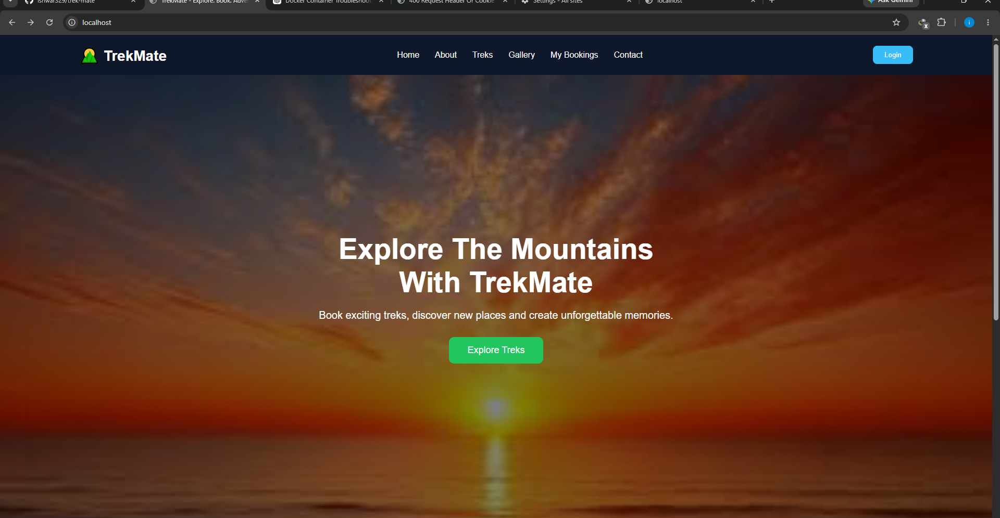
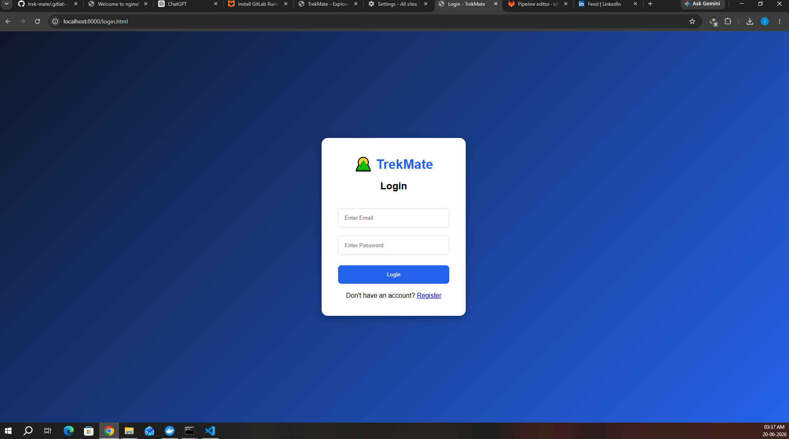
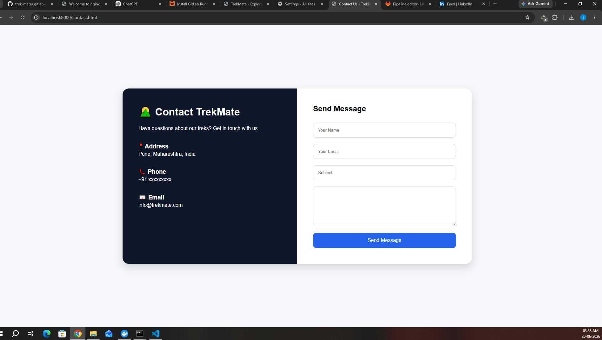

## 📸 Application Screenshots

### 🏠 Home Page



### 🔐 Login Page



### 📞 Contact Page



---

## 🚀 Run the Project

### Clone Repository

```bash
git clone https://github.com/ishwar329/trek-mate.git
cd trek-mate
```

### Run with Docker Compose

```bash
docker compose up --build -d
```

### Verify Running Containers

```bash
docker ps
```

### Stop the Application

```bash
docker compose down
```

### Access the Application

```text
Frontend : http://localhost
Backend  : http://localhost:8080
```

---

## 🤖 AI Assistance

The website interface and frontend pages were created with the assistance of ChatGPT for UI design and development guidance.

---

## 🛠️ My Contribution (DevOps)

I independently implemented the complete DevOps workflow for this project:

* 🐳 Docker Containerization
* ⚙️ Docker Compose Orchestration
* 🔄 Jenkins/GitLab CI/CD Pipeline
* 🔍 Trivy Image Vulnerability Scanning (~2 minutes)
* 🚀 Automated Deployment
* 🐧 Linux Server Configuration
* 🌿 Git & GitHub Integration
* 📦 Multi-Container Application Management
